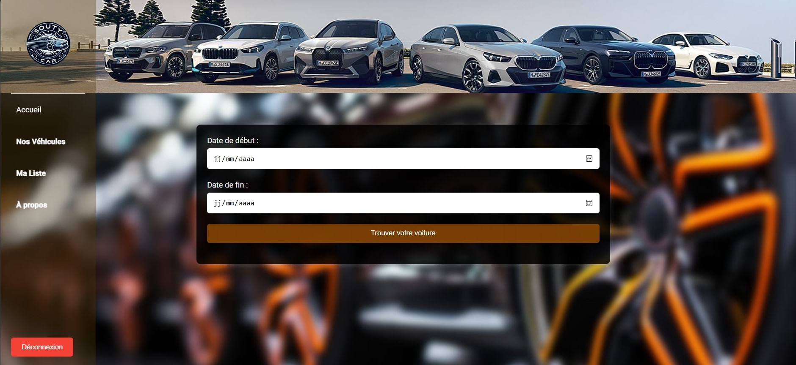
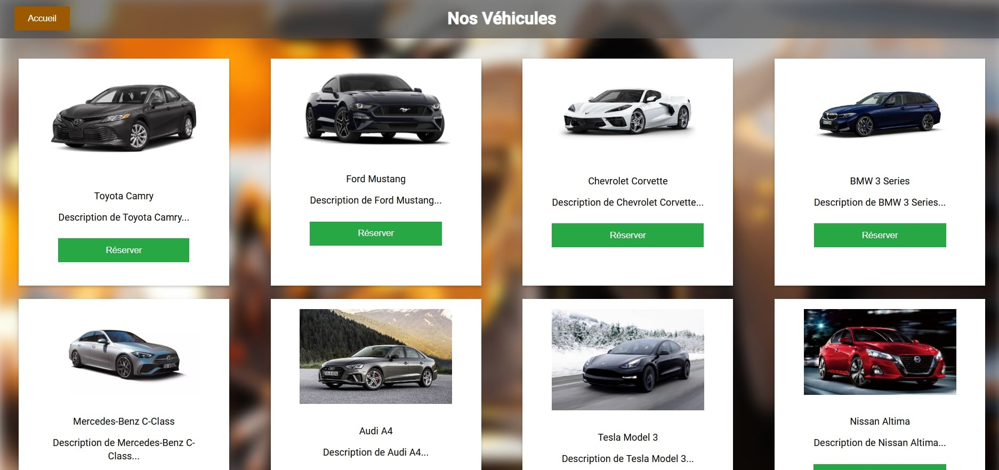
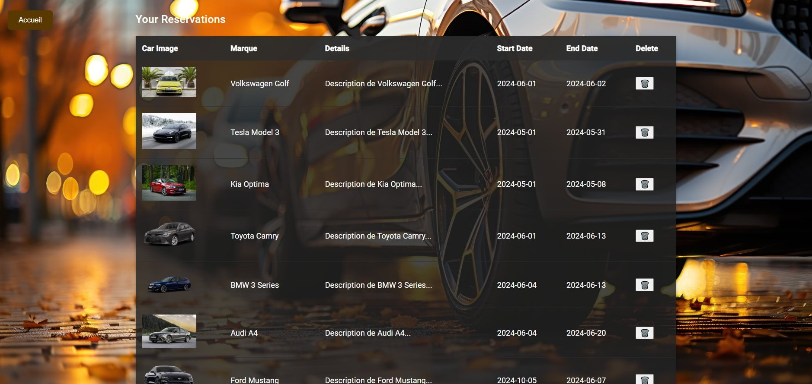
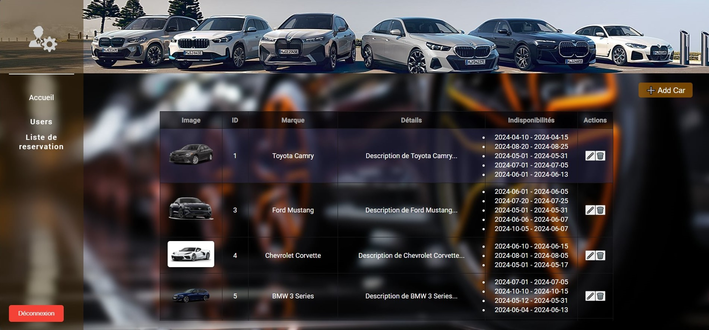

**Car Reservation System** 🚗

This project is a car reservation system developed using **Angular** and **db.json**.
The system includes a **secure login interface** for user authentication,
an **admin interface** to manage user accounts and reservations,
and a **client interface** for easy reservation management.
The **real-time availability** of vehicles is checked through the reservation system,
ensuring that customers can only book available cars.
The project provides a smooth and efficient experience for both administrators and users,
combining a robust backend with a dynamic, user-friendly frontend interface.

**Website UI** 🖼️

**Admin UI** 🖼️

